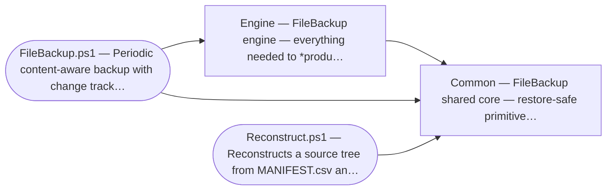

# AGENTS.md — contributor & agent guide

Everything needed to safely modify FileBackup. Users who just want to run it should read
[README.md](README.md); this file is the single source for architecture, invariants,
conventions, the test matrix, and history.

---

## 1. What this is

A Windows **PowerShell 7+** content-aware backup tool. `FileBackup.ps1` walks a source
tree, hashes files with xxHash128 (`System.IO.Hashing`), deduplicates by `(hash, size)`,
optionally 7-Zip-compresses, and records `MANIFEST.csv`. A run that supersedes earlier
content preserves it in a dated `Snapshot_<date>` folder (named by the superseded backup's
completion date — see §3) and drops a self-contained restore kit. `Reconstruct.ps1`
rebuilds the tree byte-exact from the backup root (latest state) or any snapshot
(that point in time) alone.

## 2. Architecture & module map

| File | Role | Bundled into backups? |
|---|---|---|
| `Modules/FileBackup.Common.psm1` | **Restore-safe primitives**: `Get-FileXxHash`, `Initialize-XxHashLibrary`, `Get-XxHashDllPath`, `Read-/Write-Manifest`, `Compress-/Expand-FileWithSevenZip`, `Test-ShouldCompress`, short-name encoding, `New-Logger`, `Get-FileBackupDefaults`. | **Yes** |
| `Modules/FileBackup.Engine.psm1` | **Backup-only logic**: `Update-SourceManifest`, `Compare-SourceToBackup`, `Invoke-BackupFileGroup`, `Sync-BackupStorageLayout`, `Optimize-ChangeFolders`, `Move-RemovedFilesToStaging`, `New-ReconstructScript`, `Complete-ChangeFolder`, `Invoke-BackupSet`, `Test-HashRecalcDue`, `Test-IsInfrastructureFile`, … | No |
| `FileBackup.ps1` | Thin entry point: import modules, read config, loop `Invoke-BackupSet`, optional mail. | n/a |
| `Reconstruct.ps1` | Standalone restore; imports the **bundled** Common module. | itself |
| `bash/reconstruct.sh` | **Linux/bash standalone restore** (phase `bash-v1`): one self-contained POSIX-shell file (bash 4+, gawk, xxhsum, 7z) that restores byte-exact from a backup folder on a host with no PowerShell, mirroring `Reconstruct.ps1`'s semantics against the *same* MANIFEST.csv contract. It is **not** in the generated map below (that map is PowerShell-AST-only); its internal functions (`hash_file`, `parse_manifest`, `to_posix`) are unit-tested by sourcing it under bats. See §4 for the tooling floor and README "Restore on Linux". | **Yes** |
| `Dockerfile`, `container/`, `scripts/Invoke-Container.ps1` | **Linux container runtime and lifecycle** (phase `container-v1`): digest-pinned non-root image, JSON configuration entrypoint, compressed build/restore smoke test, offline tar export, and optional OCI registry publish/pull. | n/a |

**The Common/Engine split is load-bearing.** `New-ReconstructScript` copies
`Reconstruct.ps1`, `reconstruct.sh`, `FileBackup.Common.psm1`,
`System.IO.Hashing.dll`, and a `RECONSTRUCT.paths.json` sidecar into each backup
folder so a restore needs nothing else. A backup folder additionally holds
`MANIFEST.csv.meta` — the SR-038 manifest witness — which is **not** a copied kit
artifact: `Write-Manifest` stamps each folder's own (see §3).
Therefore:

- Anything `Reconstruct.ps1` calls **must live in Common**, not Engine.
- **Common must never depend on Engine.**

### Backup pipeline (`Invoke-BackupSet`, per set, per run)
1. Resolve `SourcePath`/`BackupPath`/`ChangePath`.
2. Open `backup.log` in the change root.
3. Guard against a stale `Temp` staging folder.
4. Read persisted last-hash-run time; decide if a scheduled rehash is due.
5. `Update-SourceManifest` — walk source, (re)hash new/changed/scheduled files.
6. `Sync-BackupStorageLayout` — migrate data files if compress/tree mode changed.
7. Snapshot the pre-run manifest into staging (the point-in-time index).
8. `Compare-SourceToBackup` — pure diff (`NewOrChanged` + `RemovedFromSource`).
9. Build the working backup map.
9.5 `Save-SupersededData` — move superseded prior bytes into staging *before*
    `Invoke-BackupFileGroup` overwrites (Mirror) or orphans (HashAddressed) them.
10. `Invoke-BackupFileGroup` per `(hash,size)` — copy/compress new data once.
11. `Move-RemovedFilesToStaging` — evict removed files' data (refcount-aware).
12. Write the final backup manifest.
13. `New-ReconstructScript` + `Complete-ChangeFolder` — finalize the staging into a
    dated `Snapshot_<prior-backup-date>`, or discard it when nothing was superseded.
14. `Optimize-ChangeFolders` — collapse data shared across snapshots.
15. Persist `LastHashRun` (if a rehash ran) + `LastBackupRun` (this run's date).

### Generated dependency diagram & function map

The table above is the hand-kept editorial overview; the regions below are
**generated from the source AST** by `scripts/gen_arch_map.ps1` (the Mermaid
call-graph between modules/entry scripts, then per-module summary, internal
cross-module dependencies, and every function with its `Implements:` back-links).
Do not edit them by hand — `check.ps1` fails if they are stale. The same blocks
are mirrored in [docs/architecture.md](docs/architecture.md), which also carries
the generated `Invoke-BackupSet` flow.

<!-- BEGIN GENERATED DEPENDENCY DIAGRAM -->
_Generated by `scripts/gen_arch_map.ps1`: each arrow is a call into another
in-tree module. An arrow from `Common` into `Engine`, or from `Reconstruct.ps1`
into `Engine`, would violate the AGENTS.md §3 invariants. Do not edit by hand._


<!-- END GENERATED DEPENDENCY DIAGRAM -->

<!-- BEGIN GENERATED MODULE MAP -->
_Generated by `scripts/gen_arch_map.ps1` from the modules' AST. Do not edit by hand;
run the generator. Summary = the module's .SYNOPSIS; back-links come from `Implements:` comments._

### `Modules/FileBackup.Common.psm1`

_FileBackup shared core — restore-safe primitives._
Imports (internal): _none_

| Function | Exported | Implements |
|---|:---:|---|
| `Compress-FileWithSevenZip` | yes | SR-004, LLR-004 |
| `Convert-HexToShortName` | yes | SR-003, LLR-003 |
| `Convert-ShortNameToHex` | yes | — |
| `ConvertFrom-ManifestDateString` | yes | — |
| `ConvertTo-ManifestDateString` | yes | SR-025, LLR-025 |
| `Expand-FileWithSevenZip` | yes | SR-008, LLR-008 |
| `Get-FileBackupDefaults` | yes | — |
| `Get-FileXxHash` | yes | SR-002, LLR-002 |
| `Get-HashSizeFileName` | yes | SR-003, SR-021, LLR-003, LLR-021 |
| `Get-ManifestWitnessPath` | yes | SR-038, LLR-038 |
| `Get-XxHashDllPath` | yes | SR-007, LLR-007 |
| `Initialize-XxHashLibrary` | yes | SR-002, SR-019, LLR-002 |
| `New-Logger` | yes | — |
| `Read-Manifest` | yes | SR-025, LLR-025 |
| `Test-ManifestWitness` | yes | SR-039, LLR-039 |
| `Test-ShouldCompress` | yes | SR-004, LLR-004 |
| `Write-Manifest` | yes | SR-025, SR-038, LLR-025, LLR-038 |
| `Write-ManifestWitness` | yes | SR-038, LLR-038 |

### `Modules/FileBackup.Engine.psm1`

_FileBackup engine — everything needed to *produce* a backup._
Imports (internal): `Common`

| Function | Exported | Implements |
|---|:---:|---|
| `Assert-NoUnknownConfigKey` | no | SR-042, LLR-042 |
| `Compare-SourceToBackup` | yes | SR-001, LLR-001 |
| `Complete-ChangeFolder` | yes | SR-005, SR-028, LLR-005, LLR-028 |
| `Copy-SourceFileToBackup` | yes | SR-003, LLR-003 |
| `Get-DataFile` | yes | — |
| `Get-LastBackupRun` | yes | SR-005, SR-028, LLR-005, LLR-028 |
| `Get-LastHashRun` | yes | SR-011, LLR-011 |
| `Get-MediaMBPerSec` | yes | SR-020, LLR-020 |
| `Import-BackupConfiguration` | yes | SR-042, LLR-042 |
| `Initialize-Dependencies` | yes | SR-019 (required dep), SR-020 (optional deps), SR-016 (non-blocking) |
| `Initialize-StagingFolder` | yes | SR-005, SR-017, LLR-005, LLR-017 |
| `Invoke-BackupFileGroup` | yes | SR-003, LLR-003 |
| `Invoke-BackupSet` | yes | SR-014, SR-017, SR-035, SR-036, LLR-014, LLR-017, LLR-035, LLR-036 |
| `Move-RemovedFilesToStaging` | yes | SR-006, SR-041, LLR-006, LLR-041 |
| `New-ReconstructScript` | yes | SR-007, LLR-007 |
| `Optimize-ChangeFolders` | yes | SR-026, LLR-026 |
| `Read-BackupState` | no | SR-011, SR-028, LLR-011, LLR-028 |
| `Resolve-BackupSetDefaults` | no | SR-042, LLR-042 |
| `Resolve-BackupSetPaths` | yes | SR-014, LLR-014 |
| `Resolve-OptionalTool` | yes | SR-020 (optional-dependency degradation), SR-016 (non-blocking) |
| `Save-SupersededData` | yes | SR-010, SR-028, SR-041, LLR-010, LLR-028, LLR-041 |
| `Set-BackupStateField` | no | — |
| `Set-LastBackupRun` | yes | SR-005, SR-028, LLR-005, LLR-028 |
| `Set-LastHashRun` | yes | SR-011, LLR-011 |
| `Sync-BackupStorageLayout` | yes | SR-012, SR-013, LLR-012, LLR-013 |
| `Test-BackupConfigurationShape` | no | SR-042, LLR-042 |
| `Test-BackupManifest` | yes | — |
| `Test-HashRecalcDue` | yes | SR-011, LLR-011 |
| `Test-IsInfrastructureFile` | yes | SR-022, SR-038, LLR-022, LLR-038 |
| `Update-SourceManifest` | yes | SR-001, SR-013, SR-024, LLR-001, LLR-013, LLR-024 |
<!-- END GENERATED MODULE MAP -->

## 3. Invariants — do not break

- **Manifest schema** (9 columns): `DataPath, RelativePath, Length, LastWriteTimeStr,
  xxH2Hash, Compressed, StoredAsHashSize, Duplicate, MediaMBPerSec`. Round-trip only via
  `Read-Manifest`/`Write-Manifest`.
- **Dedup key is `(xxH2Hash, Length)`** — one physical data file per key.
- **Dated snapshots** (`Snapshot_<date>`, matching `^Snapshot_\d{4}_\d{2}_\d{2}_\d{2}_\d{2}_\d{2}`):
  one per *superseded* backup, named by that backup's completion date (persisted
  in `FileBackupState.json` as `LastBackupRun`). The **latest state has no
  snapshot** — the live backup root is it; a **no-op run creates none**. A snapshot
  holds the full point-in-time manifest plus only the bytes superseded at the next
  run (`Save-SupersededData` preserves them *before* they're overwritten/orphaned).
  **Restore authority (SR-010):** reconstruct from a snapshot uses *that snapshot's
  own manifest* as the sole authority and resolves bytes by `(hash,length)` from
  the data pool (backup root + all snapshots) — it never overlays a newer manifest.
  Clean cutover: no `Pre_*_Changes` reading/writing remains (SR-005/SR-010/SR-028).
- **The manifest witness is written by `Write-Manifest` only** (SR-038). Every
  `MANIFEST.csv` gets a `MANIFEST.csv.meta` beside it — `Version`, `Rows`,
  `Bytes`, `XxH128`, `Written` as UTF-8/no-BOM/LF `Key=Value` lines, published by
  atomic rename. One writer means backup root, staging, dated snapshots, the
  source hash cache, and every rewrite are covered and cannot drift, so **never
  stamp a witness from a caller.** Each snapshot carries **its own** witness for
  its own manifest — do **not** add the witness to `New-ReconstructScript`'s
  kit-artifact copy list (`Complete-ChangeFolder`'s artifact loop copies from the
  backup root and would overwrite each snapshot's witness with the root's; this
  is the single most dangerous mistake available in this area, pinned by TC-067).
  The witness is **root-level infrastructure** in `Test-IsInfrastructureFile` — a
  nested `sub\MANIFEST.csv.meta` is user data like any other (B6). A test that
  deliberately tampers with a manifest must re-stamp with `Write-ManifestWitness`
  or it will observe exit 3 instead of the failure it meant to exercise.
- **Restore outcome is one shared exit-code table** (SR-040): 0 complete, 1
  incomplete/content, 2 usage or precondition, 3 witness verification failed, 4
  incomplete/host — precedence 2 > 3 > 4 > 1, identical in `Reconstruct.ps1` and
  `bash/reconstruct.sh`. Normative copy lives in README "Restore exit codes".
  `Reconstruct.ps1` keeps throwing for in-process callers and only exits with a
  code under `-ExitCode`; do not make `exit` the default.
- **Reconstruct stays standalone** — no repo, no NuGet install at restore time.
- **Infrastructure files are root-level only** (`Test-IsInfrastructureFile`): a *nested*
  user file named `MANIFEST.csv`/`RECONSTRUCT.ps1`/etc. is real data (regression B6).
  Never filter data files by bare name.
- **Content-addressed data filenames carry the storage extension**: `.7z` when compressed,
  in *both* Mirror and HashAddressed modes, so `Compressed` and the filename agree.

## 4. Conventions & known gotchas

- **PowerShell 7+ only** (`pwsh`). Do not reintroduce 5.1 support — the hashing dependency's
  Desktop build needs transitive `System.Memory` assemblies.
- **Hashing:** xxHash128 via `System.IO.Hashing` (XXH3-based; faster than XXH64). **Not**
  K4os.Hash.xxHash — its 1.0.8 (final) release has no `XXH128` type. Use `Get-FileXxHash`.
- **Never `Split-Path -LiteralPath … -Parent` / `-Leaf`** — that flag combination *throws*
  on PS7. Use `[System.IO.Path]::GetDirectoryName/GetFileName` (also wildcard-safe for
  bracketed paths). Positional `Split-Path $x -Parent` is fine.
- A function that returns `@()` yields `$null` when captured — collection params that may
  receive that need `[AllowNull()][AllowEmptyCollection()]` and a null→`@()` guard.
- Use `-LiteralPath` for file ops (paths may contain `[]`, `()`, Unicode).
- `$ErrorActionPreference = 'Stop'` at script top.
- Approved PowerShell verbs (`Get-Verb`); export new functions from the module's
  `Export-ModuleMember`.
- **Comment-based help must be the first thing in a function body.** A plain
  comment line above it (e.g. `# Implements: …`) silently breaks `Get-Help` *and*
  the generated map/flow's summary harvesting. Order: `<# .SYNOPSIS … #>` block
  first, then the `# Implements: SR-###, LLR-###` back-link line. Reference SR
  ids for input ranges instead of restating them (docs/process.md §3).
- **The manifest-witness crash window is deliberate.** `Write-Manifest` writes
  `MANIFEST.csv` *then* the witness. A crash between the two leaves a **stale**
  witness that mismatches — i.e. it fails loud in the safe direction (a refused
  restore, exit 3) rather than silently passing, and the next successful run
  rewrites both. Do not "fix" this by writing the witness first.
- `Write-Host` is fine (this is a CLI/automation tool) — excluded in lint settings.
- **Linux restore tooling floor (`bash/reconstruct.sh`, phase `bash-v1`):** bash
  ≥ 4, GNU coreutils, **gawk** (FPAT-based RFC-4180 parsing — plain `awk`/mawk is
  not enough), **xxhsum** (xxHash ≥ 0.8, provides `xxh128sum`), and **7z**
  (`7z`/`7za`/`7zz`, p7zip) — the last needed only when the backup has compressed
  rows. The script checks these up front and fails loudly with remediation
  (SN-015 pattern), degrading only where the PS restorer degrades. It stays
  `shellcheck`-clean (warnings-as-errors, same bar as PSScriptAnalyzer) and is
  LF-only (`.gitattributes` pins `*.sh`/`*.bash`/`*.bats`). Both restorers apply
  the hash-recovery infrastructure-name skip **root-level only** (the contract /
  §3, B6) — `Find-DataFileByHash`'s recursive over-skip was a bug the bash work
  surfaced, fixed 2026-07-03 (TC-058).

## 5. Build / verify

```powershell
# deps + test tooling (System.IO.Hashing, Pester 5, PSScriptAnalyzer)
pwsh -File tests\Setup.ps1 -InstallDeps -InstallTestTools

# lint (must be clean) — settings live in tests/PSScriptAnalyzerSettings.psd1
Get-ChildItem -Recurse -Include *.ps1,*.psm1 -Path FileBackup.ps1,Reconstruct.ps1,Modules,tests |
    ForEach-Object { Invoke-ScriptAnalyzer -Path $_.FullName -Settings tests\PSScriptAnalyzerSettings.psd1 }

# unit (Pester 5)
Invoke-Pester -Path tests\Unit -Output Detailed

# integration (Subst backend; no admin)
.\RunAllTests.bat

# container build + compressed byte-exact roundtrip (Docker required)
pwsh -File scripts\Invoke-Container.ps1 -Action BuildAndTest
```

A change to engine/restore code must keep the **whole suite green and lint clean**
(current totals live in §6 "Current automated total"), and add/adjust a test
alongside any behavior change. `pwsh scripts/check.ps1 -Tier Full` runs it all.

## 6. Test matrix

### Axes
| Axis | Values |
|---|---|
| PowerShell edition | pwsh 7+ (only; 5.1 unsupported) |
| Storage mode × compression | `Mirror`, `Mirror+Compress`, `HashAddressed`, `HashAddressed+Compress` |
| Hash-recalc freq | `A E D W M Y N` (unit-covered, G6 / `Engine.Tests.ps1`) |
| Backend (volumes) | `Subst` (CI), `VHDX` (virtual disks), `RealUSB` (hardware) |
| Suite group | G1–G9 |
| Filesystem (hardware) | NTFS, exFAT, FAT32 (>4 GB limit) |

### Coverage — ✅ automated · 🟡 self-hosted/manual · ⛔ N/A
| | Subst (hosted CI) | VHDX (self-hosted) | RealUSB (hardware) |
|---|:---:|:---:|:---:|
| Lint / Unit                  | ✅ | — | — |
| G1–G5, G7 × 4 modes          | ✅ | 🟡 | 🟡 |
| G6 HashFrequency (7 codes)   | ✅ | ✅ | ✅ |
| G8 RealVolume                | ⛔ SKIP | ⛔ SKIP | 🟡 |
| NTFS free-space / capacity   | — | 🟡 | 🟡 |
| exFAT / FAT32 + >4 GB file   | — | — | 🟡 |
| Standalone restore (no repo) | ✅¹ | 🟡 | 🟡 |
| Container build + roundtrip   | ✅² | — | — |

¹ `RECONSTRUCT.ps1` runs from the backup folder using only bundled files; a "copy backup
elsewhere, restore, byte-compare" check is part of the hardware runbook.

² Linux CI builds the pinned image and drives a real compressed backup plus restore through
`scripts/Invoke-Container.ps1`; local execution requires Docker Desktop/Engine.

**Current automated total:** 236 integration assertions (4 modes × G1–G7 = 160, plus
G9 Rollback = 76; G8 SKIP under Subst) + 83 Pester unit/coverage tests + 45 bats
tests on Linux (`tests/bash`, run under WSL/CI); lint and `shellcheck` clean.
(Verified 2026-08-23 on a Full tier.)

### Suite groups
| Group | Covers |
|---|---|
| G1 InitialBackup  | Empty source, single file, 200-file bulk, nested `MANIFEST.csv` (B6), Unicode, bracketed paths. |
| G2 Incremental    | Rename, move, modify, delete, re-add identical/different, dedup. |
| G3 Reconstruction | Roundtrip from backup root, hash-fallback (incl. compressed), target-inside-backup rejected. |
| G4 Sanitization   | Mirror → HashAddressed migration; `StoredAsHashSize` flips. |
| G5 EdgeCases      | Stale `Temp` aborts, read-only source, idempotent second run. |
| G6 HashFrequency  | `Test-HashRecalcDue` over all 7 codes (deterministic via `-Now`). |
| G7 Determinism    | Identical re-runs ⇒ identical manifest rows; SHA-256 spot check. |
| G8 RealVolume     | USB-only sanity; SKIPs under Subst/VHDX. |
| G9 Rollback       | Dated-snapshot timeline (injected `-BackupTime`): modify/delete/add/rename/no-op over D1–D4; restore as-of each snapshot + latest, byte-exact; mixed content (text/binary/dup/already-compressed); no snapshot for the no-op/latest run. SR-005/SR-010/SR-028. |

### Backends
| Backend | Provisioning | Admin? | CI? |
|---|---|---|---|
| Subst   | `subst` over `%TEMP%` on dynamically-chosen free drive letters | no | yes |
| VHDX    | Dynamic VHDX files mounted as letters (NTFS) | yes | self-hosted only |
| RealUSB | Resolves four `FBTEST-*` labels from `tests\Config\real-volumes.json` | no* | no |

\* Only the initial partitioning (`Setup-USB.bat`) needs admin. The harness refuses any
label not matching `FBTEST-*`, so it can't touch a production volume.

### Environments
- **GitHub `windows-latest` (pwsh)** — `.github/workflows/tests.yml`: `lint` →
  PSScriptAnalyzer; `unit` → Pester (NUnit published); `integration-subst` → all 4 modes,
  JUnit published. 7-Zip ships on the runner; `System.IO.Hashing` is installed + cached.
- **GitHub `ubuntu-latest` (Docker)** — builds the container and verifies a compressed
  two-file backup, complete seven-artifact restore kit (six copied files plus the
  SR-038 `MANIFEST.csv.meta` witness), and byte-exact containerized restore.
- **Self-hosted VHDX** — gated by repo var `HAS_SELF_HOSTED_HYPERV == 'true'` on a
  `[self-hosted, windows, hyper-v]` runner. `RunAllTests.bat VHDX`.
- **Hardware (RealUSB) runbook** — `Setup-USB.bat` (wipes a USB, makes four GPT/NTFS
  `FBTEST-*` partitions, drops `real-volumes.json`), then `RunAllTests.bat RealUSB`. For
  filesystem coverage, reformat the backup partition exFAT/FAT32 and re-run; on FAT32 check
  the >4 GB single-file limit surfaces cleanly. Finally copy a produced backup folder to a
  machine without this repo, run `RECONSTRUCT.bat`, and byte-compare.

## 7. Removed auxiliary & legacy scripts (2026-07-03 cleanup)

The repo used to carry standalone personal utilities (`Auxilary/`,
`DatabaseDuplicateDeletion/` — SHA-256/`*HashTable.csv`-based ad-hoc tools,
unrelated to the engine) and superseded pre-modularization artifacts
(`Test-Backup.ps1`, `RunTests.bat`, `TestRelated/`, `PrepPropertiesFile.ps1`,
plus old scratch/prompt notes). All were **deleted 2026-07-03 with human
approval** — recover any of them from git history if ever needed
(`git log --diff-filter=D --summary`). Nothing in the maintained tree references
them. Add test coverage in `tests/`, and build configs with `CredSetEx.ps1`.

## 8. History

The first real review of this tool found it had **never actually run** (commits were tagged
"UNTESTED"). The modularization pass made it work and fixed the catalogued bugs.

### Dependency & parser defects (discovered during the work)
- **Hashing was non-functional**: the code called `K4os.Hash.xxHash.XXH128`, a type that
  does not exist in K4os 1.0.8. Switched to `System.IO.Hashing.XxHash128` (XXH3-based,
  benchmarked faster than XXH64). PS7+ now required.
- **`Split-Path -LiteralPath … -Parent` throws on PS7** (it was on line 35 of the test
  runner, so the suite couldn't start). Replaced everywhere with `[System.IO.Path]` calls.
- **Reconstruct generation was unrunnable** — it prepended assignments before `param()`.
  Now uses a `RECONSTRUCT.paths.json` sidecar; the script is copied verbatim.
- **`Write-Manifest` used the invalid `[IEnumerable[object]]` accelerator** → `[object[]]`
  with null/empty tolerance.
- **Mirror+Compress wrote `.7z` bytes without a `.7z` extension** (so the name lied and
  hash-recovery couldn't detect compression) → fixed.
- **Change-folder names could collide** within the same second → collision-safe naming.

### Catalogued review bugs fixed
B2 (`MinValue` = never run, injectable `-Now`), B3 (persisted last-hash-run in
`FileBackupState.json`), B4 (scheduled rehash actually forces a rehash), B6 (nested
`MANIFEST.csv` preserved), B7 (migrate copies + writes manifest *before* deleting old —
crash-safe), B8 (`@()` before indexing), B9 (refcount shared data on eviction), B10/B11
(reconstruct layout + capacity check on compressed rows), B15 (mail optional + `-NoMail`),
B16 (`Test-ShouldCompress` param rename), B17 (`PrepPropertiesFile.ps1` marked legacy).

### Modularization & tests
- Split the monolith into `Common` + `Engine`; thin `FileBackup.ps1`/`Reconstruct.ps1`
  entry points; approved-verb renames (`Run-BackupSet`→`Invoke-BackupSet`,
  `Should-RecalculateHashes`→`Test-HashRecalcDue`, `CalculateFileHash`→`Get-FileXxHash`,
  `GenerateReconstructScript`→`New-ReconstructScript`, `SanitizeBackupDatabase`→
  `Sync-BackupStorageLayout`, `SanitizeChangeDatabase`→`Optimize-ChangeFolders`, …).
- Reconstruct now bundles the Common module + DLL and can hash-recover compressed `.7z`
  data files.
- New modular harness (Subst picks free drive letters), Pester unit suite, lint settings,
  and CI lanes (lint + unit + Subst integration).

### Docs
Consolidated the legacy overview into `README.md` (setup & use) and this `AGENTS.md`
(architecture, invariants, tests, history); gated process and integration material now
lives under `docs/`. The earlier `IMPLEMENTATION_SUMMARY.md`,
`CHANGES.md`, `CHANGELOG.md`, `TEST_MATRIX.md`, and `tests/README.md` were folded in here.
