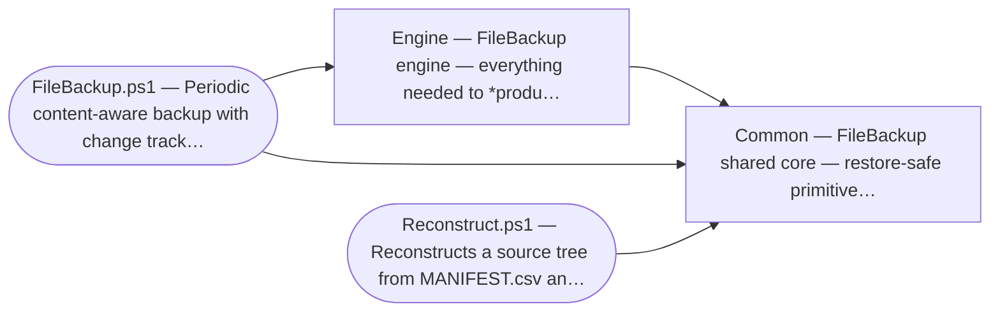

# Architecture (one page)

Owned by the **Software Engineer** hat. The authoritative architecture, module
map, invariants, and pipeline are already maintained in
[AGENTS.md](../AGENTS.md) (§2 module map, §3 invariants) — **single source of
truth; do not duplicate it here.** This page is the process's thin overview plus
the slot for the *generated* map; link to AGENTS.md for detail.

## High-level flow

Hand-written and small; diagrams are Mermaid fenced blocks (rendered natively by
GitHub and the VS Code preview — see process.md "Diagrams are text"):

See AGENTS.md §2 "Backup pipeline" for the full 15-step `Invoke-BackupSet`
sequence and `Reconstruct.ps1`'s restore path.

### Program flow (generated)

The ordered internal calls of the `Invoke-BackupSet` orchestrator, generated
from the AST by `scripts/gen_arch_map.ps1 -Flow Invoke-BackupSet` (the harness
keeps it fresh). Read alongside the hand-written 15-step pipeline in AGENTS.md
§2, which carries the control flow this list omits.

<!-- BEGIN GENERATED FLOW -->
_Generated by `scripts/gen_arch_map.ps1 -Flow Invoke-BackupSet` — the ordered internal calls
in `Invoke-BackupSet`. Keep orchestrators thin: a readable flow here means the routine
delegates instead of computing. Loops/branches are not shown — see the
hand-written pipeline overview for control flow. Do not edit by hand._

**`Invoke-BackupSet`** — Orchestrates the full backup pipeline for one set (AGENTS.md §2): walk +

1. `Resolve-BackupSetPaths` — Validates the set's SourcePath and resolves (creating if needed) the
2. `Get-LastBackupRun` — Reads the completion date of the most recent backup — it dates the *next*
3. `Read-Manifest` — Reads MANIFEST.csv from a folder, typing Length as [long] and adding a
4. `Test-ManifestWitness` — Verifies a folder's MANIFEST.csv against its witness sidecar and returns a
5. `New-Logger` — Returns a scriptblock logger that appends "<ts> [LEVEL] <msg>" to a file
6. `Initialize-StagingFolder` — Creates the run's Temp staging folder in the change root; aborts loudly
7. `Get-LastHashRun` — Reads the persisted time of the last scheduled re-hash sweep
8. `Test-HashRecalcDue` — Decides whether untouched files should be re-hashed this run, given the
9. `Test-HashRecalcDue` — Decides whether untouched files should be re-hashed this run, given the
10. `Update-SourceManifest` — Walks the source tree, (re)hashes new/changed files (and all files when
11. `New-RelativePathMap` — An empty hashtable whose RelativePath keys compare the way the local
12. `Read-Manifest` — Reads MANIFEST.csv from a folder, typing Length as [long] and adding a
13. `Get-VolumeIdentity` — A stable key naming the volume that contains a path, so two paths can be
14. `Get-VolumeIdentity` — A stable key naming the volume that contains a path, so two paths can be
15. `Test-BackupManifest` — Refuses a legacy path-addressed store (SR-061), then blanks DataPaths
16. `Write-Manifest` — Writes the canonical 9-column MANIFEST.csv to a folder, then stamps its
17. `Compare-SourceToBackup` — Pure diff: returns NewOrChanged (source rows) and RemovedFromSource
18. `New-RelativePathMap` — An empty hashtable whose RelativePath keys compare the way the local
19. `Get-BackupCapacityDemand` — Bytes this run will add to the backup volume and to the change volume
20. `Assert-BackupCapacity` — Refuses a backup set BEFORE any mutation when the destination volumes
21. `Invoke-BackupFileGroup` — Backs up one (hash,length) group: reuses an existing backup data file if
22. `Move-RemovedFilesToStaging` — Evicts data files for source-removed entries into the staging folder.
23. `Save-SupersededData` — Preserves the prior bytes of files whose content was replaced this run
24. `Write-Manifest` — Writes the canonical 9-column MANIFEST.csv to a folder, then stamps its
25. `Get-SourceDirectoryRecord` — Returns the directory rows the manifest cannot carry (SR-065): every
26. `Write-DirectorySidecar` — Writes DIRECTORIES.csv beside a manifest, or removes it when there is
27. `New-ReconstructScript` — Copies the Windows and POSIX restore entry points into the backup root,
28. `Complete-ChangeFolder` — Finalizes the staging folder into a dated point-in-time snapshot, or
29. `Optimize-ChangeFolders` — Collapses duplicate (hash,length) data files across change folders,
30. `Set-LastHashRun` — Persists the time of the completed re-hash sweep to FileBackupState.json.
31. `Set-LastBackupRun` — Persists this run's completion date to FileBackupState.json
32. `New-BrowseViewIndex` — Generates the manifest-derived browse view (SR-062): INDEX.tsv always,
<!-- END GENERATED FLOW -->

## Module responsibilities

| Module | Responsibility | Detail |
|---|---|---|
| `Modules/FileBackup.Common.psm1` | Restore-safe primitives (hashing, manifest I/O, compression, logging) — **bundled into every backup** | AGENTS.md §2 |
| `Modules/FileBackup.Engine.psm1` | Backup-only orchestration (manifest update, diff, file-group copy, change-folder lifecycle) | AGENTS.md §2 |
| `FileBackup.ps1` | Thin entry point (import, read config, loop `Invoke-BackupSet`, optional mail) | — |
| `Reconstruct.ps1` | Standalone restore using only the bundled Common module + DLL | — |

Design rules (enforced): **Common must never depend on Engine**; anything
`Reconstruct.ps1` calls must live in Common; pure cores (e.g.
`Compare-SourceToBackup`) are unit-tested, I/O shells are integration-tested; the
9-column manifest schema round-trips only via `Read-/Write-Manifest`.

## Module dependencies (generated)

The call graph between the modules and entry scripts, harvested from the AST —
each arrow is a cross-module call, so a layering violation (an arrow from
`Common` into `Engine`, or from `Reconstruct.ps1` into `Engine`) is visible at
a glance.

<!-- BEGIN GENERATED DEPENDENCY DIAGRAM -->
_Generated by `scripts/gen_arch_map.ps1`: each arrow is a call into another
in-tree module. An arrow from `Common` into `Engine`, or from `Reconstruct.ps1`
into `Engine`, would violate the AGENTS.md §3 invariants. Do not edit by hand._

<!-- END GENERATED DEPENDENCY DIAGRAM -->

<!-- BEGIN GENERATED MODULE MAP -->
_Generated by `scripts/gen_arch_map.ps1` from the modules' AST. Do not edit by hand;
run the generator. Summary = the module's .SYNOPSIS; back-links come from `Implements:` comments._

### `Modules/FileBackup.Common.psm1`

_FileBackup shared core — restore-safe primitives._
Imports (internal): _none_

| Function | Exported | Implements |
|---|:---:|---|
| `Compress-FileWithSevenZip` | yes | SR-004, LLR-004 |
| `Convert-HexToShortName` | yes | SR-003, SR-069, LLR-003, LLR-069 |
| `Convert-ShortNameToHex` | yes | SR-003, SR-069, LLR-003, LLR-069 |
| `ConvertFrom-HashSizeFileName` | yes | SR-069, SR-070, LLR-069 |
| `ConvertFrom-ManifestDateString` | yes | — |
| `ConvertTo-DirectoryAttributeFlag` | yes | SR-065, LLR-065 |
| `ConvertTo-ManifestDateString` | yes | SR-025, LLR-025 |
| `Expand-FileWithSevenZip` | yes | SR-008, LLR-008 |
| `Get-DirectoryAttributeToken` | yes | SR-065, LLR-065 |
| `Get-FileBackupDefaults` | yes | — |
| `Get-FileXxHash` | yes | SR-002, LLR-002 |
| `Get-FreeSpaceBytes` | yes | SR-052, SR-023, LLR-052, LLR-023 |
| `Get-HashSizeFileName` | yes | SR-003, SR-021, SR-069, SR-070, LLR-003, LLR-021, LLR-069, LLR-070 |
| `Get-ManifestWitnessPath` | yes | SR-038, LLR-038 |
| `Get-StoredObjectForm` | yes | SR-068, LLR-068 |
| `Get-VolumeIdentity` | yes | SR-052, LLR-052 |
| `Get-XxHashDllPath` | yes | SR-007, LLR-007 |
| `Initialize-XxHashLibrary` | yes | SR-002, SR-019, LLR-002 |
| `New-Logger` | yes | — |
| `New-RelativePathMap` | yes | SR-034, LLR-034 |
| `Read-Manifest` | yes | SR-025, LLR-025 |
| `Resolve-ExistingAncestor` | yes | SR-052, SR-023, LLR-052 |
| `Test-HashSizeFileName` | yes | SR-061, SR-069, LLR-069 |
| `Test-IsVolumeRootPseudoPath` | yes | SR-074, LLR-078 |
| `Test-LegacyStoredObjectName` | yes | SR-061, SR-069, LLR-069 |
| `Test-ManifestWitness` | yes | SR-039, LLR-039 |
| `Test-ShouldCompress` | yes | SR-004, LLR-004 |
| `Write-Manifest` | yes | SR-025, SR-038, LLR-025, LLR-038 |
| `Write-ManifestWitness` | yes | SR-038, LLR-038 |

### `Modules/FileBackup.Engine.psm1`

_FileBackup engine — everything needed to *produce* a backup._
Imports (internal): `Common`

| Function | Exported | Implements |
|---|:---:|---|
| `Assert-BackupCapacity` | yes | SR-052, SR-013, SR-014, LLR-052 |
| `Assert-NoUnknownConfigKey` | no | SR-042, LLR-042 |
| `Assert-PrunePrecondition` | yes | SR-046, SR-035, SR-039, LLR-046 |
| `Compare-SourceToBackup` | yes | SR-001, SR-053, LLR-001, LLR-053 |
| `Complete-ChangeFolder` | yes | SR-005, SR-028, LLR-005, LLR-028 |
| `Complete-PruneDeletion` | yes | SR-046, LLR-046 |
| `Copy-ReHomedDataFile` | yes | SR-045, LLR-045 |
| `Copy-SourceFileToBackup` | yes | SR-003, LLR-003 |
| `Get-BackupCapacityDemand` | yes | SR-052, SR-013, LLR-052 |
| `Get-BackupContentIndex` | yes | SR-026, SR-045, SR-047, LLR-047 |
| `Get-BackupKitRevision` | yes | SR-049, LLR-049 |
| `Get-BackupSnapshot` | yes | SR-047, LLR-047 |
| `Get-ConfigValueJsonTypeName` | no | SR-042, LLR-042 |
| `Get-CopyRetryDelayMs` | yes | SR-067, LLR-067 |
| `Get-DataFile` | yes | SR-057, SR-074, LLR-057, LLR-078 |
| `Get-LastBackupRun` | yes | SR-005, SR-028, LLR-005, LLR-028 |
| `Get-LastHashRun` | yes | SR-011, LLR-011 |
| `Get-MediaMBPerSec` | yes | SR-020, LLR-020 |
| `Get-PoolSnapshotFolder` | yes | SR-045, LLR-045 |
| `Get-PruneBatchExitCode` | yes | SR-040, SR-046, SR-048, LLR-046, LLR-048 |
| `Get-PruneCapacityRefusal` | yes | SR-046, SR-052, LLR-046 |
| `Get-SnapshotDate` | no | SR-047, LLR-047 |
| `Get-SnapshotPrunePlan` | yes | SR-045, SR-047, LLR-045, LLR-047 |
| `Get-SourceDirectoryRecord` | yes | SR-065, LLR-065 |
| `Get-StagingBootId` | yes | SR-075, LLR-080 |
| `Get-StagingContainerId` | yes | SR-075, LLR-080 |
| `Get-StagingLockState` | yes | SR-017, SR-075, LLR-080 |
| `Get-StorageFormFinding` | yes | SR-049, LLR-049 |
| `Get-StoredFileForm` | yes | SR-049, LLR-049 |
| `Import-BackupConfiguration` | yes | SR-042, LLR-042 |
| `Initialize-Dependencies` | yes | SR-019 (required dep), SR-020 (optional deps), SR-016 (non-blocking) |
| `Initialize-StagingFolder` | yes | SR-005, SR-017, LLR-005, LLR-017 |
| `Initialize-StagingHeartbeatType` | yes | SR-075, LLR-080 |
| `Invoke-BackupFileGroup` | yes | SR-003, SR-013, SR-053, SR-058, SR-060, LLR-003, LLR-053, LLR-058 |
| `Invoke-BackupSet` | yes | SR-014, SR-017, SR-035, SR-036, SR-055, LLR-014, LLR-017, LLR-035, LLR-036, LLR-055 |
| `Invoke-PruneEntrySweep` | yes | SR-046, LLR-046 |
| `Move-RemovedFilesToStaging` | yes | SR-006, SR-041, LLR-006, LLR-041 |
| `New-BrowseViewIndex` | yes | SR-062, LLR-061 |
| `New-ReconstructScript` | yes | SR-007, LLR-007 |
| `Optimize-ChangeFolders` | yes | SR-026, LLR-026 |
| `Publish-PruneManifest` | yes | SR-045, SR-038, LLR-045 |
| `Read-BackupState` | no | SR-011, SR-028, LLR-011, LLR-028 |
| `Read-StagingOwnerRecord` | yes | SR-075, LLR-080 |
| `Remove-BackupSnapshot` | yes | SR-045, SR-046, SR-040, LLR-045, LLR-046 |
| `Remove-CommittedPruneResidue` | yes | SR-046, LLR-046 |
| `Repair-BackupStorageForm` | yes | SR-049, SR-024, SR-038, LLR-049 |
| `Resolve-BackupSetDefaults` | no | SR-042, LLR-042 |
| `Resolve-BackupSetPaths` | yes | SR-014, SR-049, SR-063, LLR-014, LLR-063 |
| `Resolve-OptionalTool` | yes | SR-020 (optional-dependency degradation), SR-016 (non-blocking) |
| `Resolve-ViewRootPath` | no | SR-063, LLR-063 |
| `Save-SupersededData` | yes | SR-010, SR-028, SR-041, SR-059, LLR-010, LLR-028, LLR-041, LLR-059 |
| `Set-BackupStateField` | no | — |
| `Set-LastBackupRun` | yes | SR-005, SR-028, LLR-005, LLR-028 |
| `Set-LastHashRun` | yes | SR-011, LLR-011 |
| `Start-StagingHeartbeat` | yes | SR-075, LLR-080 |
| `Stop-StagingHeartbeat` | yes | SR-075, LLR-080 |
| `Test-BackupConfigurationShape` | no | SR-042, LLR-042 |
| `Test-BackupManifest` | yes | SR-061, SR-064, LLR-060, LLR-062 |
| `Test-BackupStorageForm` | yes | SR-049, SR-038, SR-040, SR-061, LLR-049, LLR-060 |
| `Test-ConfigValueJsonType` | no | SR-042, LLR-042 |
| `Test-CopyFailureIsTransient` | yes | SR-067, LLR-067 |
| `Test-HashRecalcDue` | yes | SR-011, LLR-011 |
| `Test-IsInfrastructureFile` | yes | SR-022, SR-038, LLR-022, LLR-038 |
| `Test-IsJsonNumber` | no | SR-042, LLR-042 |
| `Test-PoolResolves` | yes | SR-046, SR-045, LLR-046 |
| `Test-PortableRelativePath` | yes | SR-055, LLR-055 |
| `Test-StorageFormAgreement` | yes | SR-046, SR-049, LLR-046, LLR-049 |
| `Update-BackupSnapshotKit` | yes | SR-049, SR-007, SR-038, LLR-049 |
| `Update-SourceManifest` | yes | SR-001, SR-024, SR-055, LLR-001, LLR-024, LLR-055 |
| `Write-DirectorySidecar` | yes | SR-065, LLR-065 |
| `Write-StagingOwnerRecord` | yes | SR-075, LLR-080 |
<!-- END GENERATED MODULE MAP -->
